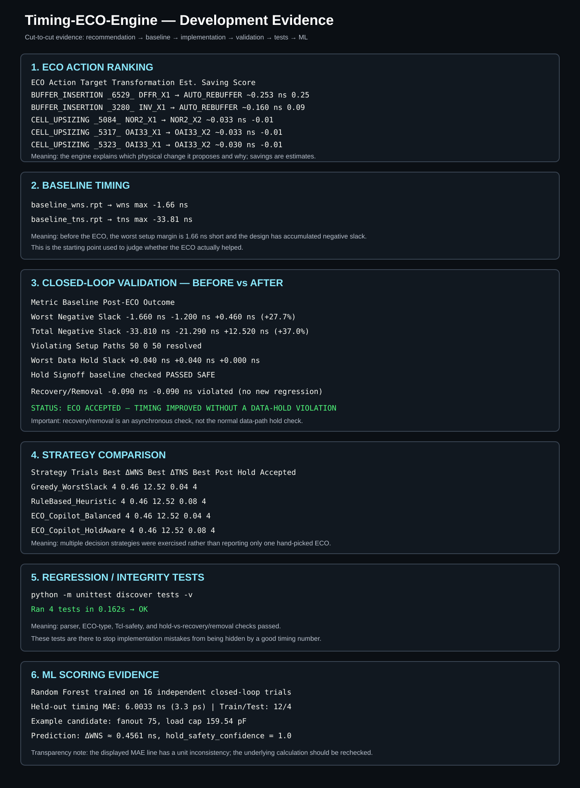

# Timing-ECO-Engine

An explainable **post-route timing ECO workflow built as a physical-design-first OpenROAD/OpenSTA flow**.

The project takes timing evidence, identifies high-impact timing bottlenecks, applies targeted ECO actions, re-legalizes and re-routes the design, and performs before/after signoff checks.

> **Design principle:** Tcl/OpenROAD/OpenSTA are the implementation layer. Python is optional supporting analysis, not the physical-design engine.

## Why this is Tcl-first

A physical-design engineer normally reasons in terms of STA paths, slack, slew, capacitance, fanout, cell drive strength, placement legalization, incremental routing, parasitic estimation, setup/hold signoff, DRC closure and ECO trade-offs.

Those operations now live visibly in the repository as OpenROAD Tcl flow stages rather than being hidden behind a Python wrapper.

```text
flow/
├── config.tcl          # technology, design and report configuration
├── baseline_sta.tcl    # routed-design loading + baseline STA
└── run_flow.tcl        # physical-design flow entry point

eco/
└── apply_eco.tcl       # targeted buffer insertion + cell resize + reroute

sta/
└── signoff.tcl         # post-ECO STA, hold and DRC evidence

scripts/
├── run_flow.sh         # Linux/Docker launcher
└── run_windows.ps1     # Windows/Docker launcher
```

OpenROAD is designed to be driven through Tcl, and this project follows that model. The flow uses incremental routing and routed-topology parasitic estimation after ECO changes.

## End-to-end PD flow

```text
                 Routed Design
                      │
                      ▼
                OpenSTA / STA
                      │
          ┌───────────┴───────────┐
          │                       │
     slack / slew            cap / fanout
          │                       │
          └───────────┬───────────┘
                      ▼
              Violation analysis
                      │
                      ▼
                ECO candidates
                 /          \
                /            \
       Buffer insertion    Cell resize
                \            /
                 \          /
                  ▼        ▼
                  OpenROAD ECO
                       │
                       ▼
              Detailed placement
                       │
                       ▼
             Incremental global route
                       │
                       ▼
                Detailed routing
                       │
                       ▼
            Routed parasitic estimate
                       │
                       ▼
                OpenSTA signoff
                  /          \
                 /            \
              setup          hold
                 \            /
                  \          /
                   ▼        ▼
                    ECO decision
               ACCEPT / REJECT
```

## Current ECO implementation

The repository uses the OpenROAD commands available in the development Docker image.

### Targeted buffer insertion

The engine does **not** turn a DFF or logic cell into a buffer. A high-fanout driver is handled by inserting a real buffer on its driven net:

```tcl
set driver [get_pins "_6529_/Q"]
set net [get_nets -of_objects $driver]

insert_buffer \
    -buffer_cell BUF_X4 \
    -net $net \
    -buffer_name ECO_BUF_6529
```

This is deliberately different from the earlier incorrect DFF-to-buffer transformation. The current flow uses OpenROAD's `insert_buffer` interface exposed by the development image.

### Cell upsizing

Combinational cells can be resized independently:

```tcl
replace_cell _5084_ NOR2_X2
```

Sequential cells and clock cells are not treated as generic combinational resize candidates.

### Physical implementation after ECO

```tcl
detailed_placement
global_route -start_incremental
global_route -end_incremental
detailed_route
estimate_parasitics -global_routing
```

Detailed placement is used to re-legalize the design after incremental changes such as resizing and buffer insertion.

## Development evidence

This repository keeps a **transparent development evidence board** derived from the six terminal/report screenshots supplied during development. It makes the cut-to-cut flow understandable even to someone who is not deeply familiar with physical design.



### 1. ECO candidate generation

The engine produced a ranked list of possible ECO actions. `_6529_` and `_3280_` were identified as high-impact fanout-related targets, while `_5084_`, `_5317_`, and `_5323_` were proposed for cell upsizing.

**Simple meaning:** this is the “what should I change?” stage. The savings shown here are estimates, not measured results.

### 2. Baseline timing

The development baseline showed **WNS = -1.66 ns** and **TNS = -33.81 ns**.

**Simple meaning:** the design starts with setup-timing failures. WNS is the worst timing margin; TNS is the accumulated negative setup slack.

### 3. Closed-loop validation

The development evidence showed:

| Metric | Baseline | Post-ECO | Change |
|---|---:|---:|---:|
| WNS | -1.660 ns | -1.200 ns | +0.460 ns |
| TNS | -33.810 ns | -21.290 ns | +12.520 ns |
| Setup-violating paths | 50 | 0 | 50 resolved |
| Worst data-hold slack | +0.040 ns | +0.040 ns | no change |

The screenshot also contains a negative recovery/removal value. That is an asynchronous timing check and is **not the same as a data-path hold violation**. The signoff flow reports these checks separately.

### 4. Strategy comparison

Four ECO-selection strategies were exercised over four trials each: `Greedy_WorstSlack`, `RuleBased_Heuristic`, `ECO_Copilot_Balanced`, and `ECO_Copilot_HoldAware`.

The values were similar for this benchmark. They are retained as experiment evidence, not presented as a universal claim.

### 5. Regression tests

The development test run reported **4 tests passed**. The tests protect implementation correctness around high-fanout identification, buffer-vs-resize semantics, and separation of data hold from asynchronous recovery/removal.

### 6. ML scoring

The development evidence reports a Random Forest trained from **16 independent closed-loop trials** with a **12/4 train/test split**.

One metric in the screenshot is internally inconsistent: it displays `6.0033 ns` together with `(3.3 ps)` for the held-out MAE. Those units cannot both represent the same numeric value, so the project does **not** treat that value as a final validated ML benchmark until the calculation/reporting is rechecked.

## Running the physical-design flow

### Windows 11 + Docker Desktop

From the repository root:

```powershell
.\scripts\run_windows.ps1
```

### Linux

```bash
./scripts/run_flow.sh
```

The launcher uses the OpenROAD/ORFS Docker image and executes `flow/run_flow.tcl`.

The image can be overridden with `OPENROAD_IMAGE` if required.

## Languages & Tool Stack

### Primary implementation languages and formats

- **Tcl** — primary physical-design flow and ECO language
- **Verilog** — RTL/netlist representation
- **SDC** — timing constraints, clocks and I/O timing definitions

### Physical-design tools

- **OpenROAD** — physical implementation, ECO, placement, CTS, routing and physical checks
- **OpenSTA** — static timing analysis and signoff

### Environment automation

- **Bash** — Linux flow launcher and automation
- **PowerShell** — Windows flow launcher and automation
- **Docker** — reproducible OpenROAD/OpenSTA environment

### Supporting analysis

- **Python** — optional report parsing, experiment aggregation, ML experiments and offline analysis; it is deliberately **not** the core PD implementation language.

## Important engineering rule

A timing improvement is not accepted merely because WNS improves.

The ECO must be checked for:

1. setup timing
2. normal data-path hold
3. asynchronous recovery/removal
4. routing completion
5. DRC/physical side effects
6. reproducibility from a clean baseline

The correct outcome can therefore be **“no safe ECO recommendation.”**

## Evidence policy

Numbers shown in the development evidence board are development evidence. A result becomes a final benchmark claim only after the exact ECO is reproduced from a clean baseline and checked for setup, data hold, asynchronous recovery/removal, routing, and design-rule side effects.

## Project status

The repository is being refactored toward a **Tcl/OpenROAD-first physical-design implementation** while preserving the existing analysis and closed-loop methodology.

The objective is not to replace OpenROAD's timing-repair engines. It is to make the engineer's ECO reasoning explicit:

**identify → diagnose → select targeted ECO → implement → re-route → sign off → accept/reject**
